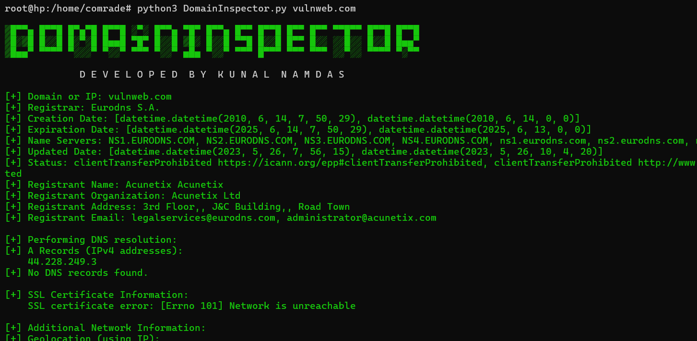

# DomainInspector

DomainInspector is a Python script that provides detailed information about domains and IP addresses. It gathers data from various sources including WHOIS, DNS records, SSL certificates, geolocation services, HTTP/HTTPS headers, reverse DNS lookup, and subdomain enumeration.

## Features

- **WHOIS Lookup**: Retrieve registrar information, creation and expiration dates, name servers, and registrant details for domains.
- **DNS Resolution**: Fetch A records (IPv4 addresses), MX records (Mail servers), and TXT records (SPF, DKIM, etc.).
- **SSL Certificate Details**: Obtain issuer, subject, validity period, version, serial number, and signature algorithm of SSL certificates.
- **Geolocation**: Determine geographical location using IP addresses.
- **Reverse DNS Lookup**: Find hostname from IP addresses.
- **HTTP/HTTPS Status and Headers**: Check status codes, reasons, and headers for both HTTP and HTTPS URLs.
- **Subdomain Enumeration**: Enumerate subdomains using the crt.sh API.


## Developer Name
#### Kunal Namdas

## Requirements

- Python 3.x
- Required Python packages listed in `requirements.txt`

## Installation

1. Clone the repository:
   ```bash
   git clone https://github.com/kunalnamdas/DomainInspector.git
   cd DomainInspector
   


#### Install dependencies:

pip install -r requirements.txt


## Usage

python domain_inspector.py URL_or_IP



## Example

python DomainInspector.py example.com


## Development

To contribute to the development of DomainInspector:

- Fork the repository.

- Create a new branch for your feature (git checkout -b feature/your-feature).

- Make your changes.

- Commit your changes (git commit -m 'Add new feature').

- Push to the branch (git push origin feature/your-feature).

- Create a pull request.

## Contributing

We welcome contributions! Please follow the steps outlined in the Development section to submit your changes.


## Acknowledgements

Thanks to the developers of the libraries and APIs used in this project:

- argparse

- python-whois

- dnspython

- requests

- geoip2

- pytz

- crt.sh


